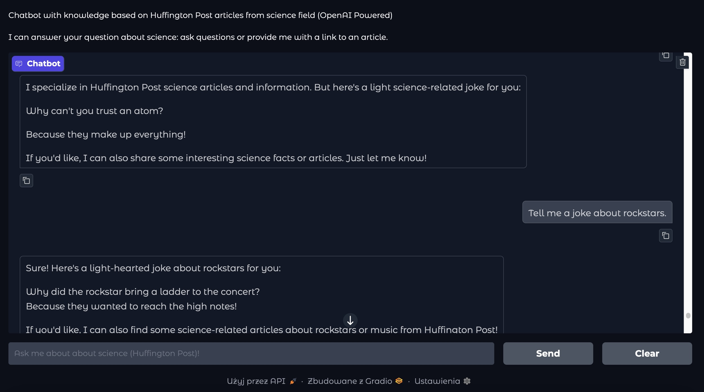

# Huffington Post articles chatbot

It is a chatbot who answers questions in collaboration with MCP server.

MCP server is implemented in [hf-articles-search](https://github.com/asidlare/hf-articles-search) repo.

Both projects use ["News Category Dataset"](https://www.kaggle.com/datasets/rmisra/news-category-dataset/data)
from kaggle.

## Goal

The goal was to implement a chatbot who works in collaboration with MCP server and:
* answers questions related to Huffington Post from science category articles stored in database and accessible through MCP server
* displays information about selected article from database when provided with its link url


## Modes

Chatbot has got built-in 2 modes:
* answering questions related to science-based Huffington Post articles
* displaying information about the selected article after providing its link url

If relevant info is not available, chatbot informs about it in a gentle way.

### Questions

When a question is asked:
* chatbot generates tags tailored to the question
* tags are sent to `search-articles-by-tag-names` tool provided by MCP server
* 2 sets of articles are generated, each set limited to 10 articles - one based on embeddings and one based on tags
* 2 sets are joined together and there can be from 10 to 20 articles in the result, because there can be common articles
* LLM uses headline, summarization, key insights, tags to find articles most relevant to the question
* the final result from LLM includes a synthesized summary (answer) and a few details about bet matching articles
* see [example answer](#example-question-and-answer)

### Info about an article after providing a link url

* `make_hashed_url` tool is called to generate a link_hash for a link_url
* `get_article_by_link_hash` tool is called to fetch info about this article
* see [example info](#example-answer-with-a-provided-url-link)

## Example question and answer

Question: `What do you know about projects handled together by NASA and SpaceX?`

Answer:
```text
NASA and SpaceX have collaborated on several significant space projects, combining NASA's expertise in space exploration with SpaceX's innovative spaceflight technologies. Here are some key highlights of projects and endeavors where NASA and SpaceX have worked together or aligned closely:

Cargo and Crew Missions to the International Space Station (ISS):
SpaceX has launched multiple Falcon 9 rockets carrying Dragon cargo capsules to the ISS with NASA's scientific equipment and supplies. These missions mark important steps in NASA's effort to reduce reliance on foreign spacecraft.
SpaceX developed and tested docking rings and spacecraft capabilities to support future NASA astronaut transport missions to the ISS.
NASA has closely monitored and certified SpaceX launches and rocket landings as part of the company's trajectory toward transporting crewed missions to the ISS.
SpaceX's Role in NASA's Deep Space Missions:
SpaceX successfully launched NASA's TESS (Transit Exoplanet Survey Satellite), aimed at discovering exoplanets, marking SpaceX’s growing role in launching high-priority NASA science missions.
NASA and SpaceX share interests in long-term human space exploration goals, including missions to Mars.
Ambitious Mars Exploration Goals:
SpaceX, led by Elon Musk, envisions sending humans to Mars by around 2025 with a large Interplanetary Transport System, aiming for a self-sustaining colony of one million people.
NASA targets Mars missions in the 2030s with spacecraft like Orion and the Space Launch System.
Both organizations focus on overcoming technical challenges for Mars exploration, such as safe landing technology, life support, and efficient propulsion systems.
Support for NASA's Lunar and ISS Facilities:
SpaceX leases and operates from NASA's historic launch pad 39A at Kennedy Space Center, which was refurbished for modern space missions.
SpaceX has demonstrated reusable rocket technology, landing Falcon 9 boosters for reflying to reduce costs, aligning with NASA's goals for sustainable space travel.
Together, NASA and SpaceX represent a partnership between governmental space exploration initiatives and private aerospace innovation, accelerating progress toward human spaceflight, lunar exploration, and Mars colonization.

Here are some of the articles with detailed information on NASA and SpaceX collaborations and shared projects:

ID 16 / EMB_ID 7 (DIST 0.5119): "SpaceX Rocket Lifts Off On Cargo Run, Then Successfully Lands At Launch Site" (published on 2016-07-18)
https://www.huffingtonpost.com/entry/spacex-rocket-cargo-run_us_578c6a24e4b03fc3ee514950
ID 17 / EMB_ID 8 (DIST 0.5125): "SpaceX Launches Rocket From NASA Pad In Florida, Completes Re-landing" (published on 2017-02-19)
https://www.huffingtonpost.com/entry/spacex-launches-rocket-from-nasa-pad-in-florida-completes-re-landing_us_58a9bf37e4b037d17d28da8e
ID 14 / EMB_ID 5 (DIST 0.503): "SpaceX Rocket Blasts Off Carrying NASA's New Planet-Hunting Telescope" (published on 2018-04-19)
https://www.huffingtonpost.com/entry/spacex-launch-tess-satellite_us_5ad83219e4b03c426dab4e24
ID 11 / EMB_ID 1 (DIST 0.4666): "Elon Musk's SpaceX Has Company In The Race To Mars" (published on 2016-10-05)
https://www.huffingtonpost.com/entry/boeing-race-to-mars_us_57f539d1e4b002a73120202e
ID 12 / EMB_ID 2 (DIST 0.4855): "SpaceX To Send Two Private Citizens Around The Moon In 2018" (published on 2017-02-27)
https://www.huffingtonpost.com/entry/spacex-moon-mission-2018_us_58b0c503e4b0a8a9b7827676
If you want, I can provide summaries or more details from any specific article about NASA and SpaceX projects.
```

## Example answer with a provided url link

URL link: https://www.huffingtonpost.com/entry/spacex-rocket-cargo-run_us_578c6a24e4b03fc3ee514950

Answer:
```text
Here is the summary of the article from Huffington Post titled "SpaceX Rocket Lifts Off On Cargo Run, Then Successfully Lands At Launch Site" published on 2016-07-18:

On July 18, 2016, SpaceX successfully launched an unmanned Falcon 9 rocket from Cape Canaveral Air Force Station to deliver cargo to the International Space Station (ISS). The Dragon capsule atop the rocket carried nearly 5,000 pounds of supplies, including food, equipment, and a miniature DNA sequencer, marking the first time such a device was sent to space. Additionally, the capsule transported a metal docking ring designed to enable future commercial spacecraft, developed by SpaceX and Boeing, to ferry astronauts to the ISS. This mission was part of NASA's effort to reduce reliance on Russian spacecraft for astronaut transport, which had been necessary since the retirement of the U.S. space shuttle fleet five years prior. After launch, the Falcon 9's main booster successfully separated and returned to land near the launch site, demonstrating SpaceX's advancing capability in rocket reusability. This marked the company's second successful ground landing and third successful landing overall in recent attempts. SpaceX plans to launch one of its recovered rockets as early as autumn 2016, aiming to further reduce launch costs through refurbishment and reuse.

Key Insights:

* SpaceX launched a Falcon 9 rocket carrying a Dragon capsule with nearly 5,000 pounds of cargo to the ISS.
* The cargo included a miniature DNA sequencer, the first of its kind to be sent to space.
* A metal docking ring was delivered to facilitate future commercial crewed missions by SpaceX and Boeing.
* The Falcon 9 booster successfully landed back at the launch site, marking a significant step in rocket reusability.
* Since retiring the space shuttle fleet, NASA has relied on Russia for astronaut transport, costing over $70 million per person.
* SpaceX aims to reduce launch costs by developing rockets that can be refurbished and reused.
* The company plans to launch one of its recovered rockets as early as autumn 2016.
* This mission demonstrated progress toward enabling commercial spacecraft to ferry astronauts to the ISS.
Tag Names: nasa, space-technology, space-exploration, international-space-station, spacex, falcon-9, dragon-capsule, rocket-landing

Link to the article: https://www.huffingtonpost.com/entry/spacex-rocket-cargo-run_us_578c6a24e4b03fc3ee514950
```

## Joke

If you try hard and force this chatbot, it can even tell you a joke but definitely prefers talks about Huffington Post articles...


